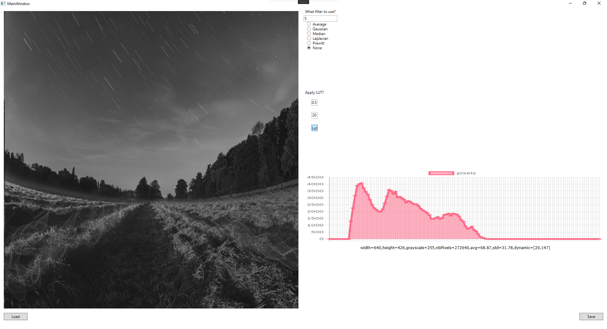

# Image Processor

A small tool implemented with .NET's WPF. Even though the UI isn't the best, but it still does the job amazingly!

## What does the tool offer:

- Load a PGM picture (both binary and ASCII)
- Apply various filters (Average, Gaussian, Median, Prewitt, Laplacian)
- Get stats about a picture (Average, Standard Deviation, Dynamic,...)
- Apply Linear Transformations.
- Save your PGM image.

## Steps:

1. Install packages.
2. Run the solution.
3. convert your image using this [converter](https://convertio.co/fr/jpg-pgm/) for example.
4. Load that image.
5. And do your magic!

## Interface:

  

### If you encounter any problem, don't hesitate to reach out!